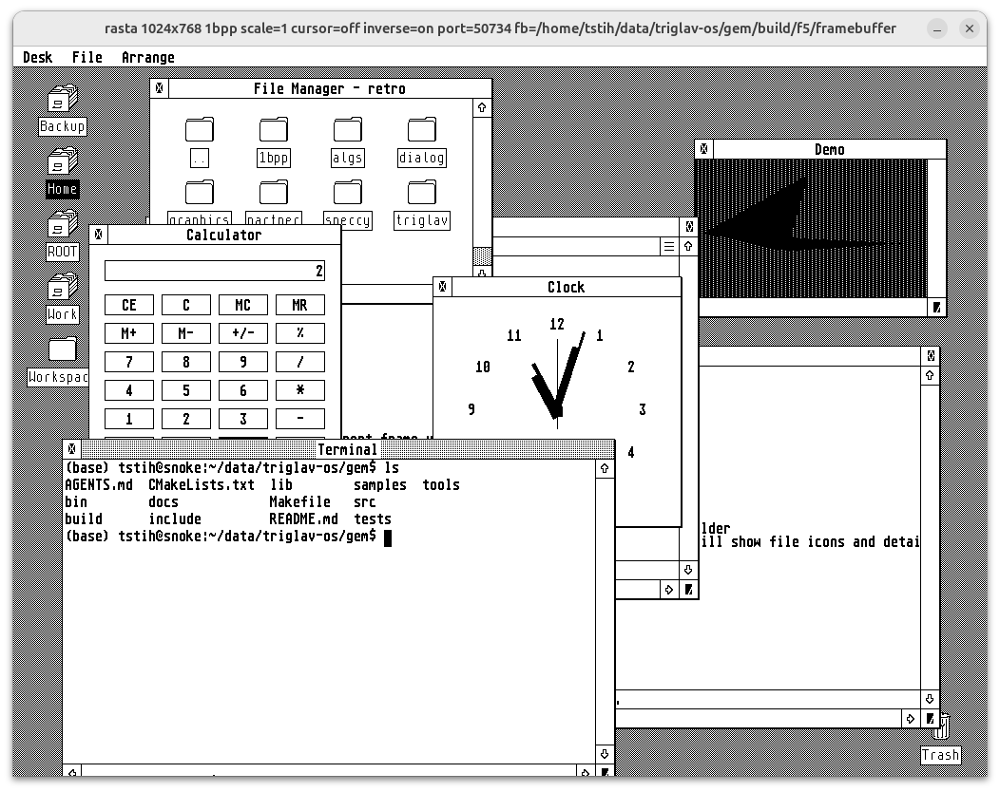

# GEM for Linux

GEM for Linux provides a classic graphical desktop with windows, menus,
dialogs, a terminal, calculator and clock. Applications share a display
server, with either a Rasta viewer or a native Linux framebuffer display.



## Build

Requires Linux, GCC/G++, GNU Make, CMake 3.20+, Git, Python 3, pkg-config,
SDL2 development files and ImageMagick. The build downloads and verifies a
pinned Rasta and Musashi source archives into ignored `build/` storage.
Subsequent builds reuse them; no separate checkouts are needed.
From the repository root:

```sh
make
make tests    # optional; results in docs/tests/LATEST.md
```

Alternatively, `make container` builds and tests using Docker; the host needs
Docker and GNU Make instead of the compiler dependencies. The first build
needs internet access. See the [build guide](docs/guides/HOSTED_DEVELOPMENT.md).

## Run

Start these commands in three separate terminals, in order. Wait for gemd
to report that it is listening before starting the desktop:

```sh
./bin/tools/rasta --inverse --port 5000
./bin/core/gemd
./bin/samples/desktop
```

Alternatively, press F5 with **GEM — all samples** in VS Code to start the
desktop and every sample together. See the
[hosted development guide](docs/guides/HOSTED_DEVELOPMENT.md) for setup and the
[samples guide](docs/guides/SAMPLES.md) for SDK builds.

## Install

Build the native Linux deployment package:

```sh
cmake -S . -B build -DCMAKE_BUILD_TYPE=Release -DGEM_PLATFORM=linux
cmake --build build --target gemix_package -j"$(nproc)"
```

Copy the complete `bin/gemix` directory to your installation location,
for example `/opt/gemix`. Native operation requires access to Linux
framebuffer and input devices. Follow the
[installation and startup guide](docs/guides/GEMIX_LINUX.md) to select devices,
set resource paths and start the installed desktop.
